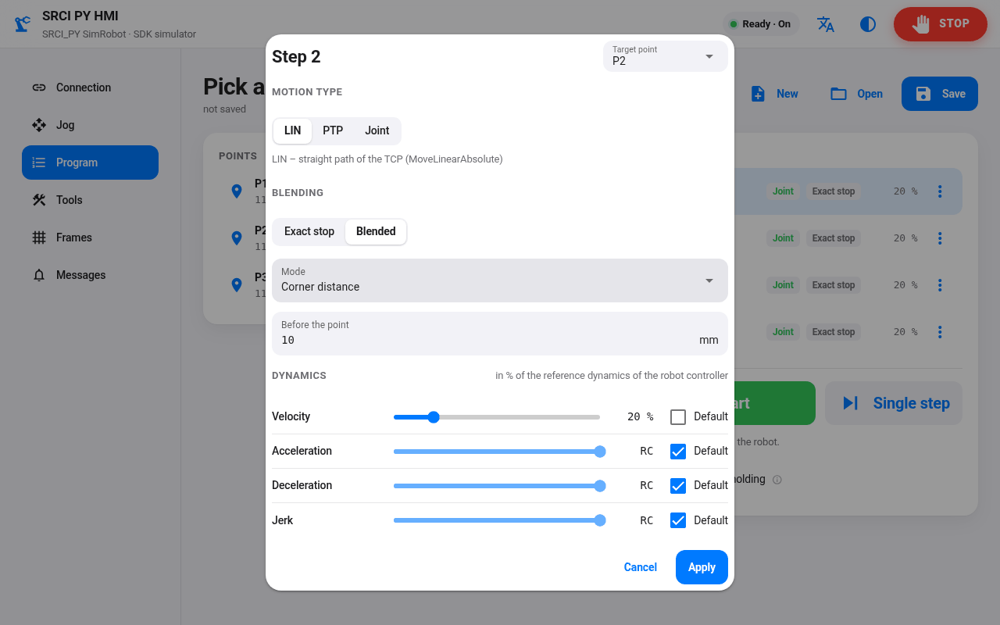

[](https://github.com/ThorstenBrach/SRCI_CLIENT_PY/actions/workflows/ci.yml)
[](https://github.com/ThorstenBrach/SRCI_CLIENT_PY/actions/workflows/release.yml)

# Standard Robot Command Interface (SRCI) – Python client


**This is an open Python client implementation of the SRCI interface, based on SRCI specification V1.5.9 (Dec 2024).**

The Standard Robot Command Interface (SRCI) is an open, manufacturer-independent standard, designed to enable seamless integration and control of robots in PLC-based automation environments. It provides a consistent communication framework that simplifies the programming and operation of industrial and collaborative robots — regardless of the specific PLC or robot brand involved.

This library brings the SRCI client to Python. Function blocks, parameters, outputs and error IDs are the same as in the open SRCI PLC library for Codesys and TwinCAT ([ThorstenBrach/SRCI](https://github.com/ThorstenBrach/SRCI)), so programs and know-how can be transferred between PLC and Python.

More information about SRCI :

👉 General Info : https://www.profibus.com/technologies/robotics-srci

👉 PLC library and Wiki : https://github.com/ThorstenBrach/SRCI/wiki

# Status

All functions of the SRCI Core Profile are implemented and tested automatically on Linux and Windows with Python 3.12 – 3.14, including tests against a simulated robot controller.

First tests with a real robot were successful: a JAKA MiniCobo (SRCI 1.1, profile Core) behind a TwinCAT PLC gateway initializes, switches on, jogs and moves joint, direct and linear, also with blended corners (see [examples/jaka_minicobo](examples/jaka_minicobo)).

Despite this progress, the software is still some way off from being ready for practical use.
Tests with further robots and further optimizations are required to ensure the functionality.

# Software delivery

The library is a pure Python package (`srci-client`, import `srci`) without runtime dependencies, Python ≥ 3.12.
Wheel and source package are attached to every [release](https://github.com/ThorstenBrach/SRCI_CLIENT_PY/releases):

```bash
pip install srci_client-<version>-py3-none-any.whl
```

or from a clone of the repository:

```bash
pip install -e .
```

# Quick start

```python
from srci.api import SrciClient
from srci.fb import MC_EnableRobotFB, MC_GroupResetFB, MC_MoveAxesAbsoluteFB, MC_ReadActualPositionFB
from srci.transport import TcpTransport

with SrciClient(TcpTransport("192.168.0.10", 5000, 256, 256)) as client:
    client.wait_initialized()  # handshake with the robot controller
    client.execute(MC_GroupResetFB())
    enable = client.enable(MC_EnableRobotFB())

    # execute: rising edge on Execute and wait for Done - returns when the robot is there
    move = MC_MoveAxesAbsoluteFB()
    move.ParCmd.JointPosition.J1 = 30.0
    client.execute(move)

    # the same in two steps: start only sets Execute, the script goes on while the robot moves
    back = MC_MoveAxesAbsoluteFB()  # J1 = 0
    client.start(back)
    while not back.Done and not back.Error:
        position = client.execute(MC_ReadActualPositionFB()).OutCmd.ActualJointPosition
        print(f"J1 = {position.J1:.1f}")  # the cycle keeps running in the background (like a PLC task)
    client.wait_done(back)  # resets Execute, raises CommandError on Error / CommandAborted

    client.disable(enable)
```

| Call | Block type | What it does |
|---|---|---|
| `execute(fb)` | Execute | rising edge on `Execute`, waits for `Done` (or `Error` / `CommandAborted`: `CommandError`), resets `Execute` |
| `start(fb)` + `wait_done(fb)` | Execute | the same in two steps, e.g. to send the next move in advance (blending) or to do something else while the robot moves |
| `enable(fb)` / `disable(fb)` | Enable | sets `Enable` and waits until the block works (`Enabled`, `Valid`, `Active`) / resets it |
| `add(fb)`, `set(fb, …)`, `remove(fb)` | any | call a block in every cycle and set its inputs yourself, like in a PLC program |

All waiting calls have a `timeout` (`WaitTimeoutError`); `check=False` returns the block
instead of raising `CommandError`.

* `srci.fb` – all function blocks (`MC_…FB`, same inputs and outputs as in the PLC library)
* `srci.types` – all data types and enums
* `srci.api.RobotProgram` – RobotTask + user data + function blocks (one "PLC program"),
  `srci.api.SrciClient` – runs it cyclically in a background thread, the sequential script
  only sets inputs and waits for results, `srci.runtime.Runner` – the cycle loop itself

Library parameters (like the library parameters of a Codesys project) are set before the first
function block is created:

```python
import srci

srci.configure(TOOL_MAX=20, FRAME_MAX=20, LOAD_MAX=20)
```

**Examples:**

* [examples/quickstart/quickstart.py](examples/quickstart/quickstart.py) – the compact template for
  users, one flat script: initialize, switch on the robot, joint and direct moves, a linear
  rectangle with blended corners, switch off (`--sim` runs it against the SDK simulator).
* [examples/core_profile](examples/core_profile) – executes every function of the profile "Core"
  and explains the library step by step ([README](examples/core_profile/README.md)).
* [examples/jaka_minicobo](examples/jaka_minicobo) – first steps with a real robot behind the
  TwinCAT PLC gateway: read everything without motion (`info`), move one joint a few degrees and
  back (`move`), probe the supported TurnMode / ConfigMode / BlendingModes (`blending`).
  The README lists what the JAKA MiniCobo supports.

# Teach pendant: SRCI_PY_HMI

[SRCI_PY_HMI](https://github.com/ThorstenBrach/SRCI_PY_HMI) is a teach pendant built on this
library: a web UI (NiceGUI) for setting up and teaching a robot from the browser or a tablet.
Connect to the robot or the SDK simulator, jog in joints, base or tool, teach points, manage
tools and frames on the robot controller and run programs with LIN / PTP / Joint steps, exact
stop or blending and their dynamics. Hold-to-run, German / English, light and dark theme.

<p>
  
  
</p>

# How it talks to the robot

SRCI is transported over PROFINET. A PLC acts as gateway: it exchanges the PROFINET process
data with the robot controller and forwards the raw SRCI telegram to Python over TCP/IP.

```
Python (srci)  --TCP, raw telegram-->  PLC gateway  --PROFINET-->  Robot controller
               <--one reply per request--
```

The PLC side is ready-made in [SRCI_TcpIp_Bridge](https://github.com/ThorstenBrach/SRCI_TcpIp_Bridge):
`FB_SrciTcpIpBridge` with an example project for **TwinCAT 3** (tested with a JAKA MiniCobo) and for
**CODESYS V3.5**.

* Python is the cycle master: it sends one telegram per cycle, the PLC answers each received
  telegram with exactly one telegram (lockstep).
* No extra framing: the telegram lengths are fixed by configuration on both sides.
* The transport is exchangeable (`srci.transport.Transport`); the library core can also be used
  without any transport (`program.step(in_bytes) -> out_bytes`).

# Development

```bash
python -m venv .venv
.venv/Scripts/activate        # Windows  (Linux: source .venv/bin/activate)
pip install -e ".[dev]"

pytest                        # tests
ruff check . && ruff format --check .
mypy
```

Some tests run against a simulated robot controller that is built from a licensed SRCI SDK. The
SDK is not part of this repository; without it these tests are skipped. With the locally built
SDK library, `python -m srci.sim.server --port 5000 --length 256` also offers the simulator as a
TCP server for PLC tests (the PLC is the client, see [docs/TRANSPORT.md](docs/TRANSPORT.md)).

The fixes of the ST code found while porting are listed in [docs/ST_FINDINGS.md](docs/ST_FINDINGS.md);
`python -m tools.st2py.export_xml` writes them back into the PLCopen XML of the PLC library
([docs/ST_XML_EXPORT.md](docs/ST_XML_EXPORT.md)).

Every test has a unique, stable ID; all test cases are described in
[docs/TestCases.md](docs/TestCases.md). `pytest --tc-report build/test-report` writes a test
report (Markdown + HTML).

Releases are created automatically for tags `vX.Y.Z` (see [CHANGELOG.md](CHANGELOG.md)).

# License

The library is licensed under the MIT license.

# Disclaimer and Delimitation

The developed software is based on the SRCI technology of "PROFIBUS and PROFINET International" (PI), but it is not an official publication of PI. It is a privately initiated project, created and currently maintained by me — but it is open to contributors for further development, improvement and ongoing maintenance.

The use of PI technology only serves to ensure the interoperability and functionality of the SRCI interface. There is no connection or partnership between this project and the PI organization.

This project is provided without any guarantee and can be used for private and commercial purposes. Any use is at the user’s own risk and responsibility.

[](https://www.paypal.com/donate/?hosted_button_id=ERN6VH9WA95J6)
